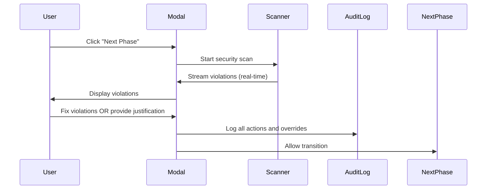

# Security Standards Validator - Functional Requirements

## 🎯 Executive Summary

The Security Standards Validator is a **Security Middleware SDLC Gate** that enforces security checkpoints during phase transitions in the AI Operation Center workflow. It operates as a **Hard Guardrail Modal** that validates both user-written and AI-generated code using a zero-trust architecture.

---

## 🚦 **The Trigger: Modal Activation**

### **Primary Triggers**
- **User Action**: User clicks "Next Phase" button
- **Phase Transitions**: Windsurf → Anti-Gravity, Anti-Gravity → VS Code
- **Auto-Transitions**: Modal appears even for agent-initiated transitions

### **Trigger Conditions**
- Modal appears **before** any phase transition occurs
- Agent output is treated as **untrusted input**
- Zero exceptions for AI-generated content
- Modal blocks workflow until security validation complete

---

## 🔍 **The Scan: Security Validation Logic**

### **Scan Scope Strategy**
**Primary Scan**: Delta Scan (Modified/Created files in current phase)
**Background Scan**: Full project sweep running asynchronously

### **OWASP LLM Top 10 Validation**

#### **LLM01: Prompt Injection**
- Detect unvalidated user inputs in prompts
- Identify prompt templates without sanitization
- Flag dynamic prompt construction vulnerabilities

#### **LLM02: Insecure Output Handling**
- Scan for raw LLM outputs displayed without sanitization
- Detect missing output validation and encoding
- Identify unsafe output rendering patterns

#### **LLM03: Training Data Poisoning**
- Detect hardcoded training data or model parameters
- Identify embedded model weights or datasets
- Flag suspicious data injection patterns

#### **LLM04: Model Denial of Service**
- Scan for resource exhaustion vulnerabilities
- Detect infinite loops or recursive calls
- Identify unbounded computational complexity

#### **LLM05: Supply Chain Vulnerabilities**
- Check insecure model/library dependencies
- Detect outdated package versions
- Flag vulnerable third-party integrations

#### **LLM06: Sensitive Information Disclosure**
- **Critical**: Hardcoded secrets, API keys, credentials
- Detect password/token leakage in code
- Identify exposed configuration files
- Flag sensitive data in comments or logs

#### **LLM07: Insecure Plugin Design**
- Scan for unsafe plugin architecture
- Detect missing plugin validation
- Identify insecure plugin communication

#### **LLM08: Excessive Agency**
- Check for overly permissive tool access
- Detect missing authorization checks
- Flag unrestricted system calls

#### **LLM09: Overreliance**
- Identify missing human validation for critical decisions
- Detect automated decision-making without oversight
- Flag missing manual review requirements

#### **LLM10: Model Theft**
- Scan for exposed model endpoints
- Detect unprotected model parameters
- Identify model extraction vulnerabilities

### **Agent OS Coding Standards**
- Hardcoded secrets and credentials detection
- Unvalidated inputs and outputs validation
- Insecure authentication patterns
- Missing error handling requirements
- Inadequate logging/auditing standards

---

## 🚪 **The Exit Condition: Guardrail Bypass Logic**

### **Path 1: Fix Errors (Primary Path)**
1. **Violation Display**: Real-time streaming of violations in modal
2. **Interactive Fixing**: User addresses violations directly in IDE
3. **Auto-Revalidation**: System scans changes immediately
4. **Dynamic Enablement**: 'Proceed' button enables when violations resolved

### **Path 2: Manual Override with Justification**
1. **Justification Required**: For each high/critical violation
2. **Mandatory Fields**:
   - Business reason for override
   - Mitigation plan and timeline
   - Risk acceptance statement
   - Expected resolution date
3. **Digital Signature**: Cryptographic signing of justification
4. **Audit Logging**: Non-repudiable entry in security-audit.log
5. **Override Enablement**: 'Proceed with Override' button activates

---

## 📊 **Real-Time Streaming Feedback**

### **Violation Streaming Architecture**
- **Immediate Discovery**: Violations appear as detected (no waiting for complete scan)
- **Progressive Loading**: Scan progress indicator with real-time results
- **Priority Ordering**: Critical violations displayed first
- **Contextual Information**: File path, line number, code snippet, fix recommendations

### **User Experience Flow**
1. **Modal Opens**: "SECURITY CHECKPOINT" header with scanning animation
2. **Real-time Updates**: Violations stream in as discovered
3. **Interactive Resolution**: Click violation to jump to code location
4. **Live Status**: Violation status updates as user fixes issues
5. **Completion**: Scan complete with final security assessment

---

## 🔐 **Security Architecture**

### **Zero-Trust Model**
- **Agent Output = Untrusted**: All AI-generated code scanned
- **Continuous Validation**: Real-time scanning during development
- **No Exceptions**: Zero bypasses for any content source

### **Non-Repudiation System**
- **Immutable Audit Log**: security-audit.log with write-once semantics
- **Digital Signatures**: All overrides cryptographically signed
- **Agent Accountability**: Track which agent introduced violations
- **Tamper Detection**: Cryptographic hashes for audit integrity

### **Threat Mitigation (STRIDE)**
- **Spoofing**: Strong authentication, developer identity verification
- **Tampering**: Immutable audit logs, cryptographic signatures
- **Repudiation**: Non-repudiable override logging
- **Information Disclosure**: Role-based access, encrypted audit data
- **Denial of Service**: Rate limiting, scan prioritization
- **Elevation of Privilege**: Principle of least privilege

---

## 📋 **Violation Data Structure**

### **Violation Object**
```typescript
interface SecurityViolation {
  id: string;                    // Unique violation identifier
  severity: 'CRITICAL' | 'HIGH' | 'MEDIUM' | 'LOW';
  category: string;              // OWASP LLM category or Agent OS standard
  title: string;                 // Human-readable violation title
  description: string;           // Detailed explanation
  file: string;                  // File path where violation found
  line: number;                  // Line number of violation
  codeSnippet: string;           // Contextual code snippet
  recommendation: string;         // Fix recommendation
  cweReference?: string;         // CWE/CAPEC reference
  agentSource?: string;           // Which agent introduced this
  status: 'OPEN' | 'IN_PROGRESS' | 'RESOLVED' | 'FALSE_POSITIVE';
  discoveredAt: Date;            // When violation was first detected
  resolvedAt?: Date;              // When violation was resolved
  override?: SecurityOverride;    // Override information if applicable
}
```

### **Override Object**
```typescript
interface SecurityOverride {
  id: string;
  violationId: string;
  justification: {
    businessReason: string;
    mitigationPlan: string;
    riskAcceptance: string;
    expectedResolution: Date;
  };
  developerId: string;
  digitalSignature: string;       // Cryptographic signature
  approvedAt: Date;
  auditLogEntry: string;         // Reference to audit log entry
}
```

---

## 🗂️ **Historical Tracking: Security Debt Ledger**

### **Violation History**
- **Complete Lifecycle**: From discovery to resolution
- **Pattern Recognition**: Track recurring violation types
- **Agent Behavior Analysis**: Identify which agents introduce specific violations
- **Trend Analysis**: Security posture over time

### **Security Metrics**
- **Violation Density**: Violations per lines of code
- **Remediation Time**: Average time to fix violations
- **Override Frequency**: How often security is overridden
- **Agent Performance**: Which agents produce most secure code

---

## 🔄 **Integration Architecture**

### **Phase Transition Integration**


### **Tool Integration Points**
- **Windsurf API**: Hook into file creation/modification events
- **Anti-Gravity API**: Monitor experimental code generation
- **VS Code Extensions**: Real-time scanning during editing
- **Agent OS Context**: Enforce 3-Layer Context standards

---

## 🎨 **Terminal UI Specifications**

### **Modal Design**
- **Theme**: Modern dark terminal aesthetic
- **Header**: "SECURITY CHECKPOINT" with ASCII scanning animation
- **Colors**: Red for critical, green for resolved, amber for warnings
- **Typography**: Monospace font for terminal feel
- **Progress**: ASCII-style progress bars and status indicators

### **Interactive Elements**
- **Violation List**: Clickable items that jump to code location
- **Fix Suggestions**: Inline recommendations with copy-paste solutions
- **Override Form**: Text areas for justification input
- **Status Indicators**: Real-time scan progress and completion status

---

## 📈 **Performance Requirements**

### **Scanning Performance**
- **Delta Scan**: <5 seconds for typical phase changes
- **Background Full Scan**: <2 minutes for entire project
- **Real-time Streaming**: <500ms from detection to display
- **UI Responsiveness**: <100ms for user interactions

### **Scalability**
- **Concurrent Users**: Support 50+ developers
- **Project Size**: Handle projects up to 100K lines of code
- **Violation Storage**: Maintain 1M+ violation records
- **Audit Log**: Immutable storage for 5+ years

---

## ✅ **Success Criteria**

### **Security Metrics**
- **100% Coverage**: All code scanned before phase transitions
- **Zero False Negatives**: No critical violations missed
- **Complete Audit Trail**: All actions logged and immutable
- **Non-Repudiation**: All overrides digitally signed

### **Developer Experience**
- **<30 Second Guardrail**: Most security checks complete within 30 seconds
- **<5 Click Resolution**: Most violations fixable with minimal clicks
- **Real-time Feedback**: Violations appear as discovered
- **Clear Guidance**: Actionable fix recommendations

### **System Reliability**
- **99.9% Uptime**: Security checkpoint always available
- **<1% False Positives**: Minimal noise for developers
- **Instant Recovery**: Modal recovers from scan failures
- **Data Integrity**: Audit logs tamper-proof and complete

---

*Functional Requirements Version: 1.0*  
*Created: January 2026*  
*Architect: User (Security-First Approach)*  
*Next Phase: Technical Specification & Implementation*
