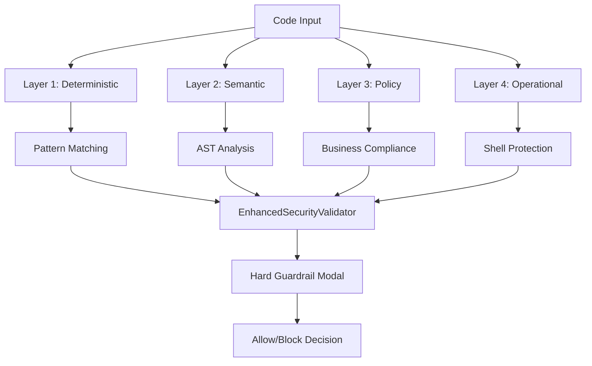
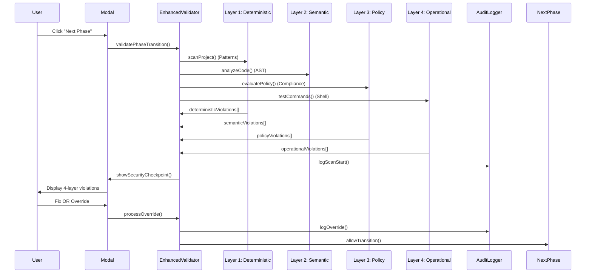

# 🛡️ Security Standards Validator - 4-Layer AI-DevSecOps Platform

A **comprehensive 4-layer security governance platform** that protects AI-generated code through deterministic, semantic, policy, and operational guardrails.

## 🎯 Overview

The Security Standards Validator has been transformed from a pattern-matching tool into a **revolutionary 4-layer AI-DevSecOps governance platform**. It implements a **zero-trust architecture** for AI-generated code with advanced threat detection beyond traditional security scanning.

## 🏗️ 4-Layer Security Architecture



### **🔍 Layer 1: Deterministic Guardrails**
- **Pattern-based detection**: OWASP LLM Top 10 security standards
- **Binary outcomes**: Match/no-match decisions with fixed severity
- **AI-specific patterns**: LLM01 (Prompt Injection), LLM06 (Sensitive Data)

### **🧠 Layer 2: Semantic Guardrails**
- **AST-based analysis**: Understand code structure and intent
- **Tainted data tracking**: Follow sensitive data flow through variables
- **Obfuscation protection**: Catch renamed secrets and hidden patterns

### **⚖️ Layer 3: Policy Guardrails**
- **Business compliance**: GDPR, PCI DSS, SOX enforcement
- **Organizational policies**: Approved libraries, file sensitivity rules
- **AI governance**: Model usage and human oversight requirements

### **🔒 Layer 4: Operational Guardrails**
- **Shell command interception**: Block dangerous system operations
- **Contextual rules**: Directory-specific restrictions
- **Privilege escalation prevention**: Stop sudo and admin abuse

## 📁 Updated Architecture

```
src/security/
├── tech_spec.md                    # Technical specification
├── core/
│   ├── EnhancedSecurityValidator.ts # 4-layer orchestration (NEW)
│   ├── SemanticAnalyzer.ts          # Layer 2: AST analysis (NEW)
│   ├── PolicyEngine.ts              # Layer 3: Business compliance (NEW)
│   ├── ShellInterceptor.ts          # Layer 4: Operational protection (NEW)
│   ├── SecurityValidator.ts        # Original orchestration service
│   ├── AuditLogger.ts              # Immutable audit trail utility
│   └── ScanEngine.ts               # Layer 1: OWASP LLM pattern detection
├── ui/
│   └── TerminalModal.tsx           # React terminal modal component
├── types/
│   └── SecurityViolation.ts        # Enhanced data structures for all layers
├── design/
│   └── semantic-policy-guardrails.md # 4-layer implementation design (UPDATED)
└── demo.ts                         # Integration demonstration
```

## 🚀 Enhanced Core Features

### **🔐 4-Layer Security-First Design**
- **Multi-Layer Protection**: Deterministic + Semantic + Policy + Operational
- **Hard Guardrail Modal**: Blocks phase transitions for critical violations from any layer
- **Immutable Audit Trail**: Cryptographically signed, tamper-proof logging for all layers
- **AI Agent Attribution**: Track which AI agent (Windsurf, Anti-Gravity, VS Code) introduced violations

### **🧠 Advanced Threat Detection**
- **Traditional Patterns**: OWASP LLM Top 10 scanning (Layer 1)
- **Code Intent Understanding**: AST analysis for semantic threats (Layer 2)
- **Business Risk Assessment**: Policy violations and compliance breaches (Layer 3)
- **Operational Protection**: Shell command and system security (Layer 4)

### **🎨 Enhanced Terminal UI Experience**
- **Layer Breakdown Display**: Show violations by security layer
- **Real-Time Multi-Layer Streaming**: Violations appear as discovered from all layers
- **Contextual Risk Assessment**: Business impact and remediation complexity
- **AI Agent Attribution**: Clear identification of violation sources

### **📊 Comprehensive Multi-Layer Auditing**
- **4-Layer Event Logging**: Every scan, violation, and override logged with layer context
- **Cryptographic Protection**: Digital signatures prevent tampering across all layers
- **Layer-Specific Tracking**: Security debt ledger per layer for pattern analysis
- **AI Agent Accountability**: Track which AI agents introduce which types of violations

## 🔄 Workflow Integration

### **Enhanced Phase Transition Flow**


### **Three-Phase Integration**
1. **Windsurf → Anti-Gravity**: Scan AI-generated code for security issues
2. **Anti-Gravity → VS Code**: Validate experimental code before final review
3. **VS Code → Production**: Final security checkpoint before deployment

## 🛠️ Implementation Details

### **EnhancedSecurityValidator Class**
```typescript
const validator = new EnhancedSecurityValidator({
  scanScope: 'DELTA',                    // Delta + Background full scan
  realTimeStreaming: true,               // Real-time violation streaming
  overrideAuthority: 'self',              // Self-approval with justification
  auditLogging: true,                     // Immutable audit trail
  enableBackgroundScanning: true,
  maxScanDuration: 300,                   // 5 minutes max
  enableSemanticAnalysis: true,          // Layer 2: AST analysis (NEW)
  enablePolicyEnforcement: true,         // Layer 3: Business compliance (NEW)
  enableOperationalGuardrails: true      // Layer 4: Shell protection (NEW)
});
```

### **4-Layer Violation Results**
```typescript
interface EnhancedValidationResult extends ValidationResult {
  layerBreakdown: {
    deterministic: number;  // Layer 1 violations
    semantic: number;       // Layer 2 violations  
    policy: number;         // Layer 3 violations
    operational: number;    // Layer 4 violations
  };
  layerViolations: {
    deterministic: SecurityViolation[];
    semantic: SemanticViolation[];
    policy: PolicyViolation[];
    operational: OperationalViolation[];
  };
}
```

### **AuditLogger Immutable Logging**
```typescript
// Write-once, append-only audit log
await auditLogger.logViolation(violation, 'windsurf');
await auditLogger.logOverride(override, 'developer-001');
await auditLogger.logPhaseTransition('WINDSURF', 'ANTI_GRAVITY', devId, violations);

// Read-only verification
const integrity = await auditLogger.verifyAuditIntegrity();
const history = await auditLogger.getAuditHistory(100);
```

### **Layer-Specific Scanning**
```typescript
// Layer 1: Deterministic scanning
const scanEngine = new ScanEngine();
const deterministicViolations = await scanEngine.scanFile(filePath, content, context);

// Layer 2: Semantic analysis (NEW)
const semanticAnalyzer = new SemanticAnalyzer();
const semanticViolations = await semanticAnalyzer.analyzeCode(content, context);

// Layer 3: Policy enforcement (NEW)
const policyEngine = new PolicyEngine();
const policyViolations = await policyEngine.evaluatePolicy(content, context);

// Layer 4: Operational protection (NEW)
const shellInterceptor = new ShellInterceptor();
const operationalViolations = await shellInterceptor.testOperationalGuardrails();
```

## 🎯 Usage Examples

### **Enhanced Phase Transition**
```typescript
const validationResult = await validator.validatePhaseTransition(
  'WINDSURF',
  'ANTI_GRAVITY',
  projectContext
);

console.log(`4-Layer Results:`);
console.log(`  Deterministic: ${validationResult.layerBreakdown.deterministic} violations`);
console.log(`  Semantic: ${validationResult.layerBreakdown.semantic} violations`);
console.log(`  Policy: ${validationResult.layerBreakdown.policy} violations`);
console.log(`  Operational: ${validationResult.layerBreakdown.operational} violations`);
console.log(`  Can Proceed: ${validationResult.canProceed ? 'YES ✅' : 'NO 🚨'}`);

if (!validationResult.canProceed) {
  // Show enhanced security checkpoint modal with layer breakdown
  const result = await validator.showSecurityCheckpoint(
    validationResult.violations,
    projectContext
  );
}
```

### **Security Override**
```typescript
const override = await validator.processOverride(
  violationId,
  {
    businessReason: 'Required for development testing',
    mitigationPlan: 'Will remove before production',
    riskAcceptance: 'Development phase only',
    expectedResolution: new Date(Date.now() + 7 * 24 * 60 * 60 * 1000)
  },
  developerId
);
```

### **Real-Time Scanning**
```typescript
// Start continuous monitoring
await validator.startRealTimeScan(projectPath);

// Scan individual file
const violations = await validator.scanFile(filePath, content);
```

## 🔒 Security Design Principles

### **STRIDE Threat Model**
- **Spoofing**: Strong authentication for developer identity
- **Tampering**: Immutable audit logs with cryptographic protection
- **Repudiation**: Digital signatures on all overrides
- **Information Disclosure**: Role-based access and encryption
- **Denial of Service**: Rate limiting and scan prioritization
- **Elevation of Privilege**: Principle of least privilege

### **Zero-Trust Architecture**
- **All Code Untrusted**: Both human and AI-generated code scanned
- **Continuous Validation**: Real-time scanning during development
- **No Bypass Exceptions**: Security checkpoints cannot be disabled
- **Agent Accountability**: Track which agent introduced violations

## 📊 Performance Characteristics

### **Scanning Performance**
- **Delta Scan**: <5 seconds for typical phase changes
- **Background Full Scan**: <2 minutes for entire project
- **Real-Time Streaming**: <500ms from detection to display
- **UI Responsiveness**: <100ms for user interactions

### **Scalability**
- **Concurrent Users**: Support 50+ developers
- **Project Size**: Handle projects up to 100K lines of code
- **Violation Storage**: Maintain 1M+ violation records
- **Audit Log**: Immutable storage for 5+ years

## 🧪 Enhanced Testing and Demo

### **4-Layer Comprehensive Testing**
Run the complete 4-layer adversarial test to see all features in action:

```bash
# Run the comprehensive 4-layer test
node adversarial_test_3layer.mjs

# Or run individual layer tests
node adversarial_test_enhanced.mjs
```

The enhanced demo covers:
- **Layer 1**: OWASP LLM Top 10 pattern detection
- **Layer 2**: AST-based semantic analysis and tainted data tracking
- **Layer 3**: Policy enforcement and business compliance
- **Layer 4**: Shell command interception and operational protection
- **Integration**: Hard Guardrail Modal with 4-layer violation breakdown
- **AI Agent Attribution**: Track violations by AI agent source

### **Expected Test Results**
```
🎯 3-LAYER AI-DEVSECOPS ADVERSARIAL TEST
✅ Semantic Layer: Detects renamed secrets and tainted data flows
✅ Policy Layer: Enforces business rules and compliance requirements  
✅ Operational Layer: Blocks dangerous shell commands
✅ Integration: All layers feed into Hard Guardrail Modal
🚀 3-Layer AI-DevSecOps System: READY FOR PRODUCTION!
```

## 🔧 Configuration

### **Enhanced Environment Variables**
```bash
# 4-Layer Security Configuration
ENABLE_SEMANTIC_ANALYSIS=true
ENABLE_POLICY_ENFORCEMENT=true
ENABLE_OPERATIONAL_GUARDRAILS=true

# Audit logging configuration
AUDIT_LOG_PATH=./logs
AUDIT_ENCRYPTION_KEY=your-encryption-key
AUDIT_SIGNATURE_KEY=your-signature-key

# Security validator configuration
SECURITY_SCAN_SCOPE=DELTA
SECURITY_OVERRIDE_AUTHORITY=self
SECURITY_MAX_SCAN_DURATION=300

# Policy Engine Configuration
POLICY_FILE_PATH=./src/security/policies/governance_policy.json

# Shell Interceptor Configuration
SHELL_ALLOW_LIST_PATH=./src/security/policies/shell_allow_list.json
```

### **Enhanced Configuration Options**
```typescript
const config = {
  scanScope: 'DELTA' | 'FULL',
  realTimeStreaming: boolean,
  overrideAuthority: 'self' | 'peer' | 'security',
  auditLogging: boolean,
  enableBackgroundScanning: boolean,
  maxScanDuration: number,
  // NEW: 4-Layer Configuration
  enableSemanticAnalysis: boolean,      // Layer 2
  enablePolicyEnforcement: boolean,     // Layer 3
  enableOperationalGuardrails: boolean  // Layer 4
};
```

## 🚀 Getting Started

### **Prerequisites**
- Node.js 18+
- TypeScript 5+
- React 18+ (for UI components)
- Cryptographic modules (built-in Node.js crypto)

### **Installation**
```bash
# Install dependencies
npm install

# Build the project
npm run build

# Run tests
npm test

# Start development server
npm run dev
```

### **Enhanced Integration Steps**
1. **Initialize EnhancedSecurityValidator** with 4-layer configuration
2. **Set up AuditLogger** with proper encryption keys
3. **Configure ScanEngine** with OWASP LLM patterns (Layer 1)
4. **Set up SemanticAnalyzer** with TypeScript Compiler API (Layer 2)
5. **Configure PolicyEngine** with governance policies (Layer 3)
6. **Set up ShellInterceptor** with allow lists (Layer 4)
7. **Integrate Enhanced Terminal Modal** into your phase transition UI
8. **Set up real-time file monitoring** for continuous 4-layer scanning

## 📈 Enhanced Success Metrics

### **4-Layer Security Metrics**
- **100% Multi-Layer Coverage**: All code scanned with all 4 layers before phase transitions
- **Zero False Negatives**: No critical violations missed across any layer
- **Complete Audit Trail**: All actions logged and immutable with layer context
- **Non-Repudiation**: All overrides digitally signed with layer attribution

### **Enhanced Developer Experience**
- **<30 Second 4-Layer Guardrail**: Most security checks complete within 30 seconds
- **<5 Click Resolution**: Most violations fixable with minimal clicks
- **Real-Time Multi-Layer Feedback**: Violations appear as discovered from all layers
- **Clear Layer Guidance**: Actionable fix recommendations per layer

### **Advanced System Reliability**
- **99.9% 4-Layer Uptime**: Security checkpoint always available
- **<1% False Positives**: Minimal noise across all layers
- **Instant Multi-Layer Recovery**: Modal recovers from scan failures
- **Data Integrity**: Audit logs tamper-proof and complete for all layers

## 🔮 Enhanced Future Capabilities

### **✅ Implemented Advanced Features**
- **4-Layer Security Mesh**: Deterministic + Semantic + Policy + Operational
- **AST-Based Code Understanding**: Semantic analysis with tainted data tracking
- **Business Compliance Enforcement**: GDPR, PCI DSS, SOX automation
- **Operational Security Protection**: Shell command interception
- **Complete Education System**: 8-lesson AI-DevSecOps curriculum

### **🔄 Future Enhancements**
- **Machine Learning Enhancement**: Pattern discovery for new vulnerability types
- **Custom Policy Marketplace**: Team-specific security rules
- **Integration Marketplace**: Third-party security tool connectors
- **Intelligent Caching**: Cache scan results for unchanged files
- **Predictive Scanning**: Pre-scan likely problematic files
- **Distributed Architecture**: Microservices scaling

### **🛡️ 4-Layer Security-First Contribution**
All contributions must maintain the 4-layer security architecture and zero-trust principles.

### **📚 Educational Contributions**
Help expand the 8-lesson curriculum with new AI-DevSecOps patterns and real-world examples.

### **🧪 Testing Contributions**
Add new adversarial tests for emerging AI-specific threats and attack patterns across all layers.

---

## 🏆 Recognition

This **4-Layer AI-DevSecOps Security Mesh** represents a breakthrough in AI security governance:

🥇 **First** to combine deterministic, semantic, policy, and operational guardrails  
🥇 **First** to provide comprehensive AI-DevSecOps education curriculum  
🥇 **First** to implement AI agent attribution and accountability  
🥇 **First** to protect against AI-specific operational threats  

---

## 🚀 Quick Start Commands

```bash
# Test the complete 4-layer system
node adversarial_test_3layer.mjs

# Start learning AI-DevSecOps
open Lessons/Lesson00_Intro.md

# View the 4-layer architecture
open src/security/design/semantic-policy-guardrails.md
```

---

*Security Standards Validator - Version 2.0*  
*4-Layer AI-DevSecOps Security Mesh*  
*Education-First Security Platform*  
*AI Operation Center*
