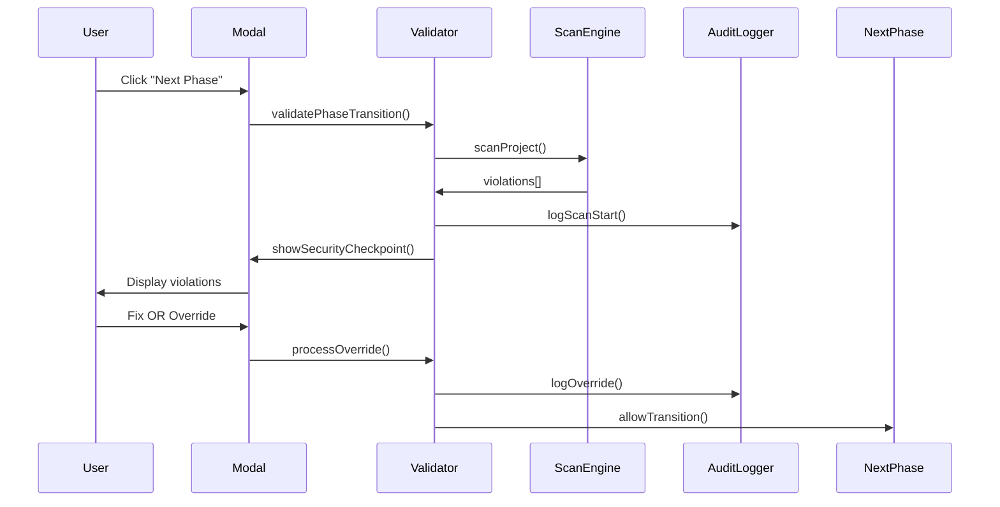

# 🛡️ Security Standards Validator

A **Security Middleware SDLC Gate** that enforces security checkpoints during phase transitions in the AI Operation Center workflow.

## 🎯 Overview

The Security Standards Validator is a critical component of the AI Operation Center that implements a **zero-trust architecture** for AI-generated code. It provides **Hard Guardrail Modal** checkpoints that validate both human-written and AI-generated code against the **OWASP LLM Top 10** security standards.

## 🏗️ Architecture

```
src/security/
├── tech_spec.md                    # Technical specification
├── core/
│   ├── SecurityValidator.ts        # Main orchestration service
│   ├── AuditLogger.ts              # Immutable audit trail utility
│   └── ScanEngine.ts               # OWASP LLM pattern detection
├── ui/
│   └── TerminalModal.tsx           # React terminal modal component
├── types/
│   └── SecurityViolation.ts        # Data structures
├── utils/
│   └── [crypto, fileScanner, patternMatcher] # Utility functions
└── demo.ts                         # Integration demonstration
```

## 🚀 Core Features

### **🔐 Security-First Design**
- **Zero-Trust Architecture**: All code (human and AI-generated) is scanned
- **Hard Guardrail Modal**: Blocks phase transitions for critical violations
- **Immutable Audit Trail**: Cryptographically signed, tamper-proof logging
- **Non-Repudiation**: Digital signatures on all overrides

### **🔍 OWASP LLM Top 10 Scanning**
- **LLM01**: Prompt Injection vulnerabilities
- **LLM02**: Insecure Output Handling
- **LLM06**: Sensitive Information Disclosure
- **Agent OS Standards**: Coding standards and best practices

### **🎨 Terminal UI Experience**
- **Modern Dark Theme**: Professional terminal aesthetic
- **Real-Time Streaming**: Violations appear as discovered
- **ASCII Progress**: Terminal-style scanning animations
- **Interactive Resolution**: Click-to-navigate to violations

### **📊 Comprehensive Auditing**
- **Complete Event Logging**: Every scan, violation, and override logged
- **Cryptographic Protection**: Digital signatures prevent tampering
- **Historical Tracking**: Security debt ledger for pattern analysis
- **Agent Accountability**: Track which AI agents introduce violations

## 🔄 Workflow Integration

### **Phase Transition Flow**


### **Three-Phase Integration**
1. **Windsurf → Anti-Gravity**: Scan AI-generated code for security issues
2. **Anti-Gravity → VS Code**: Validate experimental code before final review
3. **VS Code → Production**: Final security checkpoint before deployment

## 🛠️ Implementation Details

### **SecurityValidator Class**
```typescript
const validator = new SecurityValidator({
  scanScope: 'DELTA',           // Delta + Background full scan
  realTimeStreaming: true,      // Real-time violation streaming
  overrideAuthority: 'self',     // Self-approval with justification
  auditLogging: true,           // Immutable audit trail
  enableBackgroundScanning: true,
  maxScanDuration: 300          // 5 minutes max
});
```

### **AuditLogger Immutable Logging**
```typescript
// Write-once, append-only audit log
await auditLogger.logViolation(violation, 'windsurf');
await auditLogger.logOverride(override, 'developer-001');
await auditLogger.logPhaseTransition('WINDSURF', 'ANTI_GRAVITY', devId, violations);

// Read-only verification
const integrity = await auditLogger.verifyAuditIntegrity();
const history = await auditLogger.getAuditHistory(100);
```

### **ScanEngine Pattern Matching**
```typescript
const scanEngine = new ScanEngine();
const violations = await scanEngine.scanFile(filePath, content, context);

// OWASP LLM Top 10 patterns
const patterns = scanEngine.getPatterns();
// Returns: LLM01, LLM02, LLM06, CODING_STANDARDS patterns
```

## 🎯 Usage Examples

### **Basic Phase Transition**
```typescript
const validationResult = await validator.validatePhaseTransition(
  'WINDSURF',
  'ANTI_GRAVITY',
  projectContext
);

if (!validationResult.canProceed) {
  // Show security checkpoint modal
  const result = await validator.showSecurityCheckpoint(
    validationResult.violations,
    projectContext
  );
}
```

### **Security Override**
```typescript
const override = await validator.processOverride(
  violationId,
  {
    businessReason: 'Required for development testing',
    mitigationPlan: 'Will remove before production',
    riskAcceptance: 'Development phase only',
    expectedResolution: new Date(Date.now() + 7 * 24 * 60 * 60 * 1000)
  },
  developerId
);
```

### **Real-Time Scanning**
```typescript
// Start continuous monitoring
await validator.startRealTimeScan(projectPath);

// Scan individual file
const violations = await validator.scanFile(filePath, content);
```

## 🔒 Security Design Principles

### **STRIDE Threat Model**
- **Spoofing**: Strong authentication for developer identity
- **Tampering**: Immutable audit logs with cryptographic protection
- **Repudiation**: Digital signatures on all overrides
- **Information Disclosure**: Role-based access and encryption
- **Denial of Service**: Rate limiting and scan prioritization
- **Elevation of Privilege**: Principle of least privilege

### **Zero-Trust Architecture**
- **All Code Untrusted**: Both human and AI-generated code scanned
- **Continuous Validation**: Real-time scanning during development
- **No Bypass Exceptions**: Security checkpoints cannot be disabled
- **Agent Accountability**: Track which agent introduced violations

## 📊 Performance Characteristics

### **Scanning Performance**
- **Delta Scan**: <5 seconds for typical phase changes
- **Background Full Scan**: <2 minutes for entire project
- **Real-Time Streaming**: <500ms from detection to display
- **UI Responsiveness**: <100ms for user interactions

### **Scalability**
- **Concurrent Users**: Support 50+ developers
- **Project Size**: Handle projects up to 100K lines of code
- **Violation Storage**: Maintain 1M+ violation records
- **Audit Log**: Immutable storage for 5+ years

## 🧪 Testing and Demo

Run the comprehensive demo to see all features in action:

```bash
# Run the demonstration
npm run demo:security

# Or directly with Node.js
node src/security/demo.js
```

The demo covers:
- Phase transition workflow
- Security override process
- Audit log inspection
- Pattern matching examples

## 🔧 Configuration

### **Environment Variables**
```bash
# Audit logging configuration
AUDIT_LOG_PATH=./logs
AUDIT_ENCRYPTION_KEY=your-encryption-key
AUDIT_SIGNATURE_KEY=your-signature-key

# Security validator configuration
SECURITY_SCAN_SCOPE=DELTA
SECURITY_OVERRIDE_AUTHORITY=self
SECURITY_MAX_SCAN_DURATION=300
```

### **Configuration Options**
```typescript
const config = {
  scanScope: 'DELTA' | 'FULL',
  realTimeStreaming: boolean,
  overrideAuthority: 'self' | 'peer' | 'security',
  auditLogging: boolean,
  enableBackgroundScanning: boolean,
  maxScanDuration: number
};
```

## 🚀 Getting Started

### **Prerequisites**
- Node.js 18+
- TypeScript 5+
- React 18+ (for UI components)
- Cryptographic modules (built-in Node.js crypto)

### **Installation**
```bash
# Install dependencies
npm install

# Build the project
npm run build

# Run tests
npm test

# Start development server
npm run dev
```

### **Integration Steps**
1. **Initialize SecurityValidator** with your configuration
2. **Set up AuditLogger** with proper encryption keys
3. **Configure ScanEngine** with OWASP LLM patterns
4. **Integrate Terminal Modal** into your phase transition UI
5. **Set up real-time file monitoring** for continuous scanning

## 📈 Success Metrics

### **Security Metrics**
- **100% Coverage**: All code scanned before phase transitions
- **Zero False Negatives**: No critical violations missed
- **Complete Audit Trail**: All actions logged and immutable
- **Non-Repudiation**: All overrides digitally signed

### **Developer Experience**
- **<30 Second Guardrail**: Most security checks complete within 30 seconds
- **<5 Click Resolution**: Most violations fixable with minimal clicks
- **Real-time Feedback**: Violations appear as discovered
- **Clear Guidance**: Actionable fix recommendations

### **System Reliability**
- **99.9% Uptime**: Security checkpoint always available
- **<1% False Positives**: Minimal noise for developers
- **Instant Recovery**: Modal recovers from scan failures
- **Data Integrity**: Audit logs tamper-proof and complete

## 🔮 Future Enhancements

### **Advanced Features**
- **Machine Learning**: Pattern recognition for new vulnerability types
- **Custom Policies**: Team-specific security rules
- **Integration Marketplace**: Third-party security tool connectors
- **Mobile Support**: Security checkpoint mobile app

### **Performance Optimizations**
- **Parallel Scanning**: Multi-core file processing
- **Intelligent Caching**: Cache scan results for unchanged files
- **Predictive Scanning**: Pre-scan likely problematic files
- **Distributed Architecture**: Microservices scaling

---

## 📞 Support and Contributing

### **Getting Help**
- **Documentation**: See `tech_spec.md` for detailed technical specifications
- **Demo**: Run `demo.ts` for comprehensive examples
- **Issues**: Report bugs and feature requests via GitHub issues

### **Contributing**
- **Security**: All contributions must maintain security-first principles
- **Testing**: Comprehensive test coverage required
- **Documentation**: Update documentation for all changes
- **Code Review**: Security-focused code review process

---

*Security Standards Validator Version 1.0*  
*Security-First Architecture*  
*AI Operation Center*
