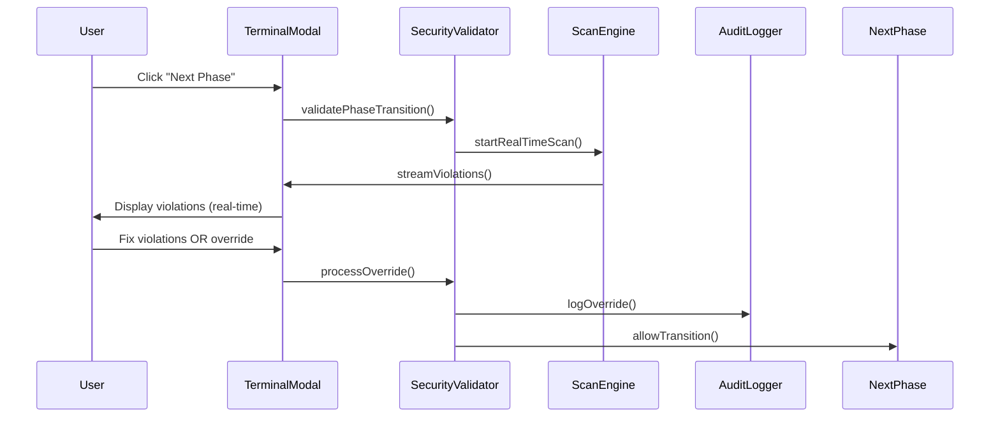

# Security Standards Validator - Technical Specification

## 🏗️ Architecture Overview

The Security Standards Validator is implemented as a **Security Middleware SDLC Gate** with three core components:
1. **SecurityValidator** - Main orchestration service
2. **AuditLogger** - Immutable audit trail utility
3. **TerminalUIModal** - Security checkpoint interface

---

## 📁 Directory Structure

```
src/security/
├── tech_spec.md                    # This file
├── core/
│   ├── SecurityValidator.ts        # Main validation service
│   ├── AuditLogger.ts              # Immutable audit utility
│   ├── ScanEngine.ts               # OWASP LLM pattern detection
│   └── ViolationDetector.ts        # Individual violation scanners
├── ui/
│   ├── TerminalModal.tsx           # React terminal modal component
│   ├── ViolationList.tsx           # Real-time violation display
│   ├── ProgressBar.tsx             # ASCII-style progress indicator
│   └── OverrideForm.tsx           # Security justification form
├── types/
│   ├── SecurityViolation.ts        # Violation data structures
│   ├── SecurityOverride.ts         # Override data structures
│   └── AuditEvent.ts              # Audit log event types
└── utils/
    ├── crypto.ts                   # Digital signature utilities
    ├── fileScanner.ts             # File system scanning
    └── patternMatcher.ts          # OWASP pattern matching
```

---

## 🔐 SecurityValidator Class Structure

```typescript
interface SecurityValidatorConfig {
  scanScope: 'delta' | 'full';
  realTimeStreaming: boolean;
  overrideAuthority: 'self' | 'peer' | 'security';
  auditLogging: boolean;
}

class SecurityValidator {
  private config: SecurityValidatorConfig;
  private auditLogger: AuditLogger;
  private scanEngine: ScanEngine;
  private terminalUI: TerminalModal;

  constructor(config: SecurityValidatorConfig) {
    this.config = config;
    this.auditLogger = new AuditLogger(); // Immutable instance
    this.scanEngine = new ScanEngine();
    this.terminalUI = new TerminalModal();
  }

  // Core validation workflow
  async validatePhaseTransition(
    fromPhase: Phase, 
    toPhase: Phase, 
    projectContext: ProjectContext
  ): Promise<ValidationResult>;

  // Real-time scanning
  async startRealTimeScan(projectPath: string): Promise<void>;
  async scanFile(filePath: string): Promise<SecurityViolation[]>;

  // Override management
  async processOverride(
    violationId: string, 
    justification: SecurityJustification
  ): Promise<OverrideResult>;

  // Security checkpoint modal
  async showSecurityCheckpoint(
    violations: SecurityViolation[]
  ): Promise<CheckpointResult>;
}
```

---

## 📋 AuditLogger Class Structure

```typescript
interface AuditEvent {
  id: string;
  timestamp: Date;
  eventType: 'SCAN_START' | 'VIOLATION_FOUND' | 'OVERRIDE' | 'PHASE_TRANSITION';
  developerId: string;
  agentSource?: string;
  data: Record<string, any>;
  digitalSignature: string;
  checksum: string;
}

class AuditLogger {
  private readonly logPath: string;
  private readonly encryptionKey: string;
  private readonly writeOnce: boolean = true;

  constructor() {
    this.logPath = 'security-audit.log';
    this.encryptionKey = process.env.AUDIT_ENCRYPTION_KEY;
    this.initializeImmutableLog();
  }

  // Immutable logging methods
  async logScanStart(developerId: string, projectPath: string): Promise<void>;
  async logViolation(violation: SecurityViolation, agentSource?: string): Promise<void>;
  async logOverride(override: SecurityOverride): Promise<void>;
  async logPhaseTransition(fromPhase: Phase, toPhase: Phase): Promise<void>;

  // Read-only access (agents cannot modify)
  async getAuditHistory(limit?: number): Promise<AuditEvent[]>;
  async verifyAuditIntegrity(): Promise<boolean>;

  // Cryptographic methods
  private generateDigitalSignature(event: AuditEvent): string;
  private calculateChecksum(event: AuditEvent): string;
  private encryptEvent(event: AuditEvent): string;
}
```

---

## 🎨 Terminal UI Components

### **TerminalModal Component**
```typescript
interface TerminalModalProps {
  violations: SecurityViolation[];
  scanProgress: number;
  onFixViolation: (violationId: string) => void;
  onRequestOverride: (violationId: string, justification: string) => void;
  onProceed: () => void;
}

const TerminalModal: React.FC<TerminalModalProps> = ({
  violations,
  scanProgress,
  onFixViolation,
  onRequestOverride,
  onProceed
}) => {
  // Modern dark terminal theme
  // ASCII-style progress animation
  // Real-time violation streaming
  // Security checkpoint header
};
```

### **ViolationList Component**
```typescript
interface ViolationListProps {
  violations: SecurityViolation[];
  streaming: boolean;
  onViolationClick: (violation: SecurityViolation) => void;
}

const ViolationList: React.FC<ViolationListProps> = ({
  violations,
  streaming,
  onViolationClick
}) => {
  // Real-time streaming display
  // Severity-based color coding
  // Click-to-navigate functionality
  // Fix suggestions inline
};
```

---

## 🔍 Scan Engine Architecture

### **ScanEngine Class**
```typescript
class ScanEngine {
  private detectors: Map<string, ViolationDetector>;
  private patternMatcher: PatternMatcher;

  constructor() {
    this.initializeDetectors();
  }

  async scanProject(projectPath: string, scope: ScanScope): Promise<SecurityViolation[]>;
  async scanFile(filePath: string, content: string): Promise<SecurityViolation[]>;
  async startRealTimeScan(projectPath: string): Promise<Observable<SecurityViolation>>;

  private initializeDetectors(): void {
    // OWASP LLM Top 10 detectors
    this.detectors.set('LLM01', new PromptInjectionDetector());
    this.detectors.set('LLM02', new InsecureOutputDetector());
    this.detectors.set('LLM03', new TrainingDataDetector());
    this.detectors.set('LLM04', new DenialOfServiceDetector());
    this.detectors.set('LLM05', new SupplyChainDetector());
    this.detectors.set('LLM06', new SensitiveInfoDetector());
    this.detectors.set('LLM07', new InsecurePluginDetector());
    this.detectors.set('LLM08', new ExcessiveAgencyDetector());
    this.detectors.set('LLM09', new OverrelianceDetector());
    this.detectors.set('LLM10', new ModelTheftDetector());
  }
}
```

### **ViolationDetector Interface**
```typescript
interface ViolationDetector {
  readonly category: string;
  readonly severity: ViolationSeverity;
  
  detect(content: string, context: ScanContext): Promise<SecurityViolation[]>;
  getPatterns(): SecurityPattern[];
  generateFix(violation: SecurityViolation): FixSuggestion;
}
```

---

## 📊 Data Flow Architecture



---

## 🔒 Security Design Principles

### **Immutable Audit Trail**
- **Write-Once Semantics**: Audit logs cannot be modified once written
- **Cryptographic Protection**: Digital signatures prevent tampering
- **Agent Isolation**: Agents have read-only access to audit logs

### **Zero-Trust Architecture**
- **All Code Untrusted**: Both human and AI-generated code scanned
- **Continuous Validation**: Real-time scanning during development
- **No Bypass Exceptions**: Security checkpoints cannot be disabled

### **Non-Repudiation**
- **Digital Signatures**: All overrides cryptographically signed
- **Developer Accountability**: Track who introduced violations
- **Complete Traceability**: Full audit trail for compliance

---

## 🎯 Implementation Priority

### **Phase 1: Terminal UI Foundation**
1. **TerminalModal Component**: Basic modal with modern dark theme
2. **ViolationList Component**: Real-time streaming display
3. **ProgressBar Component**: ASCII-style progress indicator
4. **Mock Data**: Simulated violations for testing

### **Phase 2: Scan Engine Core**
1. **ScanEngine Class**: Basic orchestration logic
2. **ViolationDetector Interface**: Standard detector pattern
3. **PatternMatcher Utility**: OWASP LLM pattern matching
4. **FileScanner Utility**: File system integration

### **Phase 3: Security Integration**
1. **SecurityValidator Class**: Main orchestration service
2. **AuditLogger Class**: Immutable audit trail
3. **Override Management**: Security justification workflow
4. **Phase Transition Integration**: Tool-specific hooks

### **Phase 4: Advanced Features**
1. **Real-time Scanning**: Background file monitoring
2. **Agent Tracking**: Which agent introduced violations
3. **Security Metrics**: Historical tracking and analytics
4. **Performance Optimization**: Delta scanning and caching

---

## 🚀 Getting Started

**Recommended Implementation Order:**
1. **Terminal UI Modal** (establish feedback loop)
2. **Scan Engine Logic** (core validation)
3. **SecurityValidator Service** (orchestration)
4. **AuditLogger Utility** (immutable logging)

This approach ensures we have visible feedback early while building the security foundation layer by layer.

---

*Technical Specification Version: 1.0*  
*Created: January 2026*  
*Security-First Architecture*
